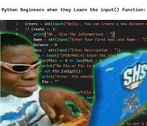

# trabajo_notebooklm
crear un programa de python en el que resuelva los problemas que plantea el pdf mandado 

resumen del trabajo de notebooklm:

se presenta como un trabajo de guía didactica para hacernos entender como funcionan las estructuras de datos en python

# nivel 1: el problema de las variables individuales 
- nos plantea un problema para darnos susoenso y entrar en fondo

# nos proponen el sistema*
- nos introducen las listas como solución

# nos explican anatomia de como se plantea una lista*

# pasamos al nivel 2: el entrenamiento
- esta parte es muy interesante porque nos ayudan a mutar las variables 

- agregamos y eliminamos cosas con las funcionnes que observamos en el programa 

# nivel 3: un superpoder adquirido
- aprendemos a usar un programa mucho mas apachurrado pero es mucho mas eficiente a la hora de introducir variables muchos mas grandes 

o sea, nos da guias para hacer procesos cortos con una cantidad conciderablemente grande.

- y listo, todo parece complejo pero cuando cogemos la practica, ya no hay nadie que nos pueda parar 

# GRACIAS 

# Ejercicio No. 3:
- Escriba una función que reciba una lista y que devuelva como resultado una tupla almacenando el primero y el ultimo elemento de la lista. En caso de que la lista no tenga dos o mas elementos debe indicarlo y no procesar los datos.

# Ejercicio No. 4:
- Escriba una función que reciba una lista y devuelva el total de numeros positivos que contiene.